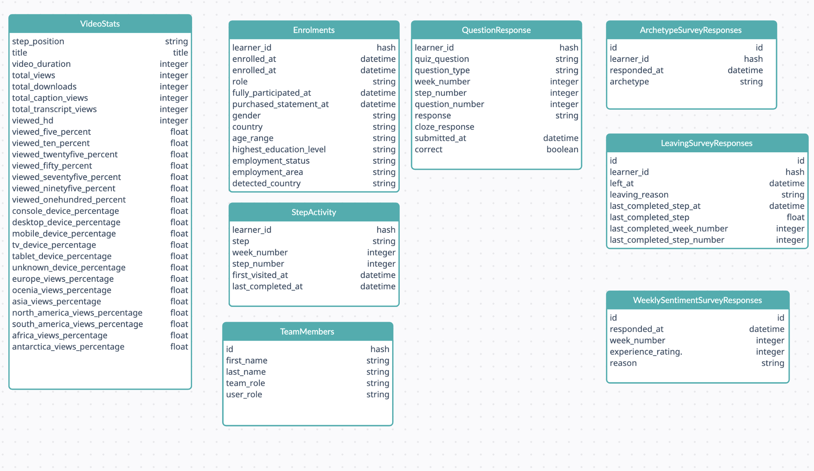

```{r setup, include=FALSE}
library(knitr)
knitr::opts_chunk$set(echo = TRUE)
knitr::opts_knit$set(root.dir= normalizePath('..'))
knitr::opts_chunk$set(fig.pos = 'H')

```


```{r, echo=FALSE,warning=FALSE,message=FALSE,error=FALSE, results='hide'}
library(ProjectTemplate)
load.project()

```

# Introduction

FutureLearn is an online open course platform in various fields and subjects. The cyber security course is presented by researchers from Newcastle University’s School of Computing Science. It is not just a video-based course, it has sections such as articles, discussions and quizzes. This course is opened in certain periods and many people benefit from this course.


#  Implementation of the CRISP-DM

# Business Understanding

Businesses are making effort to achieve an edge with their content marketing program. Showing an article’s reading time to each article can have a profound and positive effect on reader engagement levels. The first benefit is that users to help them choose the right article for the right amount of available time they have. Another advantage is that estimated reading time impacts engagement metrics seriously. Lastly, it helps to make analyzes according to certain groups.

Reading time is calculated based on the number of words read by the average human per minute. Generally, this average value per minute is between 200 and 250 words. Therefore, the total number of words in the article is divided by this determined average.

However, scientific articles are not like blog posts. Reading time varies according to one's knowledge, age, country even article subject .For example, professionals can read articles more quickly than students or older people who read slower. Hence,  we are not making an accurate estimate by using the conventional calculation method.

In this study, the data will be analyzed and the article reading time will be examined in which groups and how it changes. Then, a regression model using these features will be developed that can predict article reading time on a per-person basis.


##  Business objectives

The following sections will focus on:

- 1. Does the time spent on these articles differ according to certain groups ?
- 2. How effective are the articles in the course ? 
- 3. What is the average read time for each article ?
- 4. Can we estimate the reading time per person ?

##  Data Mining Goals

The business objectives are defined, it's time to translate it into a data mining reality

- Explore and find features one of the run data sets 
- Build predictive model with 2 min RMSE


#  Data Understanding

We will gather, describe and explore the data to make sure it fits the business goal. There are 6 different course periods(runs) and the data is stored in different files and there are 53 in total. It can cause confusion and inefficiency during analysis. We must store and use them in a structured way in our analysis. For this, we transformed our files in a structured way using **regex**. The function is implemented in **libs/globals.R** file.

Every run includes 8 data sets as the followings:

-   **enrolments:** includes user data
-   **video.stats:** contains video statistics information
-   **team.members:** team member list such as educator, host
-   **step.activity:** all users first visit and end time information for each step
-   **leaving.survey.responses:** includes survey answers after leaving the course
-   **weekly.sentiment.survey.responses:** includes weekly survey responses.
-   **question.response:** contains the answers given by the users in the quizzes
-   **archetype.survey.responses:** contains the answers given by the users in archetype survey

However, run 1 and 2 does not include video.stats and also run 1 does not include team.members data.

## Gathering and Describing Data

To achieve our business goal , we will use step.activity and enrolments datasets.

### Step Activity Summary


The description of each column/variable can be seen below:

-   **learner_id:** learner unique id
-   **step:** step id
-   **week_number:** week number
-   **step_number:** step low id
-   **first_visited_at:** first visited time with timezone
-   **last_completed_at:** completed time with timezone


### Enrolment Summary

-   **learner_id:** learner unique id
-   **enrolled_at:** enrolment datetime
-   **unenrolled_at:** unerolment datetime
-   **role:** role
-   **fully_participated_at:**
-   **purchased_statement_at:**
-   **gender:**
-   **country:**
-   **detected_country:**
-   **age_range:**
-   **highest_education_level:**
-   **employment_status:**
-   **employment_area:**

Other data are as follows;



## Data Quality

Before starting the analysis part, we should check data quality. First of all, the step column in step.activity is numeric. We should convert it to a string column. Column transform operations were performed in the `munge/01-Transform-Datatype.R` file.

Since the step column is numeric, the values 2.2 to 2.20 appear as 2.2. We should fix this first, then convert the categorical column. This operation was implemented in `munge/02.Fix-StepID-StepActivity.R`

In the enrollment data set, there are many missing values in age_range, country, employment_area. There are 2 columns for country information. One is the country name given by the user, and the other is the country name determined by the system.

Before proceeding to the exploratory analysis, some feature engineering steps were applied to provide a more comfortable visualization of the data.

New columns are added as following:

-   **completed** (step_activity) : it is a boolean column that represents whether completed or not
-   **is_unenroll** (enrolments) : it is a boolean column that represents whether undo the enrollment or not

These operations implemented in `munge/03-FeatureEngineering.R`

And also, to analyze for all step activity, all files should be merged. So we need to add a new column called **run_id** to all our data and merge the data. This operation was implemented in `munge/04-MergeDataFrames.R`


## Data Exploratory Analysis

```{r echo=FALSE}
include_graphics(paste0(getwd(),"/graphs/run_1_step_activity_count.png")) 
```

```{r echo=FALSE}
include_graphics(paste0(getwd(),"/graphs/run_1_step_activity.png")) 
```

```{r echo=FALSE}
include_graphics(paste0(getwd(),"/graphs/run_3_step_activity.png")) 
```


Firstly, it should be noted in the graph that the step steps are not sequential. The most striking part of the graph is that approximately 750 students did not complete **step 1.1**. The number of completing the step starts with 1500. After 10 steps, this number varies between 500 and 750 for the rest of the course. In addition, the number of participation in **step 3.18** is quite low.


```{r echo=FALSE}
include_graphics(paste0(getwd(),"/graphs/all_step_activity.png")) 
```


When we look at the graphics for each run, we see that there is a similar pattern. However, In the last steps of Run 1, it seems that the rate of non-completion is higher than the others and the overall number of enrollment is also quite high.

When looked carefully, there are 2 spaces in Run 3. Whereas, a gap was occurred in our first chart only at **step 3.18**. And also these gaps were formed in the runes other than Run 1. It raises suspicion that there may be any missing step. Let's check it.

```{r}
step_activity %>%
  group_by(run_id) %>%
  summarise(n_distinct(step))
```

As we thought, there are missing and extra steps. Because of these different steps, we can misinterpret our data.


# Data Preparation

## Feature Engineering

##   External Data - Continents

Country-based visualizations can also be difficult to interpret as there are many country names. For this, continent data that mapped countries from outside was found and merged with enrollment data.


##  External Data - Step Activity Metadata 
We will create a map list that includes names, types and step_id. 


```{r}
head(run_3.step.metadata)
```
Then, we will merge with step activity data frames.

```{r}
df.filtered <- step_activity %>% dplyr::filter(!run_id %in% c(1,2)) # run 1  and run 2 are not same structure
df.filtered <-  merge(x= df.filtered, y = run_3.step.metadata, by.x = "step", by.y="step_id", all.x = TRUE)

```


##  Calculating Time Difference


In order to achieve our business goal, we need to calculate the total elapsed time. We can find difference time between **first_visited_at** and **last_completed_at**.Since some records do not have the last time date, we will specify their value as 0. 


It was stated in one of the business objectives that the reading date would be estimated. 
It will be better in terms of user experience to estimate this estimate in half-minute intervals instead of seconds. We need to round the data in seconds to numbers such as 6.30 minutes, 7 minutes. The name of this newly created column will be called **elapsed_time**.

These operations were implemented in `munge/03-FeatureEngineering.R`


## Filter Data Frame

We only need to filter records that have a last completed date.

```{r}

df.filtered  <- df.filtered  %>% filter(diff_second != 0)

```


# Data Understanding

As we know, **CRISP-DM** is not a linear process. To make sure it fits the business and data mining goal, we can go back to data understanding.

There are html files attached with details about the course in data files. These html files contain the names and step types of all the steps. We can use them to find missing and extra steps. And also, we need step types(article, video, etc) in our analysis.


##  Data Exploratory Analysis

```{r echo=FALSE}
include_graphics(paste0(getwd(),"/graphs/run3_step_activity_with_type.png")) 
```


This bar chart represents the number of participants of each step with their step type. 


## Boxplot of Elapsed time for each step

```{r echo=FALSE}
include_graphics(paste0(getwd(),"/graphs/filtered_run_elapsed_time_boxplot_by_step.png")) 
```


First of all, since there are too many steps, it is difficult to determine which step the points belong to. However, it is clear that there are many outliers in the data. It might be better to see them on the box plot.


### Boxplot of elapsed time for each type

```{r echo=FALSE}
include_graphics(paste0(getwd(),"/graphs/filtered_run_elapsed_time_boxplot.png")) 
```


Some users may have left the site open during some steps and left the computer. So we may be seeing these outliers. It seems difficult to interpret the graphs because there are outliers, so we should clean these outliers. The interquartile range is a common method used to find outliers in data. Basically, we can implement this method to clean our outliers.

On the other hand, in order to make a demographic interpretation, we need to combine our data with the enrolment data set.


# Data Preparation

## Filter Steps

In the remaining analysis, it will be made on the articles. Therefore, it is necessary to filter the data and retrieve only the articles.

```{r}
df.article <- df.filtered  %>% filter(step_type == "ARTICLE")
unique(df.article$step)
```


###  Outlier Detection

When the data is analyzed, we see that the outliers are quite large. It seems that they spend more than 10 hours with steps, but such a thing is not possible. To avoid this issue, it should be defined a threshold for these values then filtered.

```{r}
threshold <- 30 * 60 # 30 minute

df.article <- df.article %>% filter(diff_second < threshold)
```


Only this way of filtering does not remove outliers from the data. An outlier detection method needs to be applied. IQR method will be used in this study. In ProjectTemplate structure, lib folder is a good place to store external functions. So, our outlier detection method which IQR was implemented in **lib/helpers.R** file. 

Importantly, instead of calculating an outlier over the entire data directly, we will calculate an outlier for each step.

```{r}
outliers <- df.article  %>% group_by(step) %>% summarise(val=helper.iqr(diff_second)) %>% summarise(min_outlier=min(val))
head(outliers)
```

Outliers should be deleted from the data frame.

```{r}
### Merge outliers with main df
df.article  <- merge(x= df.article  , y= outliers, by.x = "step", by.y="step", all.x = TRUE)

### Delete outliers
df.article  <-  df.article  %>% mutate(is_outlier = ifelse(diff_second < min_outlier, FALSE, TRUE))

## filter outlier values
df.article  <- df.article  %>% filter(is_outlier==FALSE)

```


### Merge User Metadata

We will merge our last data frame with run_3.enrolments data. By doing this, we will be able to interpret users while performing exploratory analysis.

```{r}
df.article  <- merge(x=df.article , y=enrolments, by=c("learner_id"="learner_id", "run_id"="run_id"), all.x = TRUE)

```

### Check missing values

```{r}
unique(df.article[which(is.na(df.article$age_range) == TRUE), ]$learner_id)
```


```{r}
missing_learner_id  <- unique(df.article[which(is.na(df.article$age_range) == TRUE), ]$learner_id)
```


### filter missing learner ids
```{r}
df.article <-  df.article  %>% filter(!learner_id %in% missing_learner_id)
```


#  Data Understanding

## Exploratory Data Analysis


## Plot Reading Time in Seconds For Each Article

```{r echo=FALSE}
include_graphics(paste0(getwd(),"/graphs/reading_time_diff_second_by_step.png")) 
```


As you can see, each article has a different range.

###  Calculate Average Article Reading Time

One of the business objectives was average article read time. It should be noted that **geometric mean** is used to reduce the effect of outlier values.
The function was implemented in `lib/helpers.R` file.

```{r}
## Calculate geometric mean for every article
df.article.mean <- df.article %>% group_by(step) %>% summarise(mean_diff_second = helper.geo_mean(diff_second))

```


###  Plot Average Article Reading Time

```{r echo=FALSE}
include_graphics(paste0(getwd(),"/graphs/article_average_reading_time.png")) 
```


According to the bar graph, the step with the highest average is **step 2.18**. The name of this step is *"Bitcoin: a cryptocurrency *. This topic can be considered interesting. Looking at the lowest averages are 1.18 and 3.20 which names are *"Recapping our exploration of privacy"* and *"Wrapping up"*. The common feature of these 2 steps is that it is a summary article. From this graph it can be interpreted that users are not very interested in summarizing articles.


### Select an Article and Plot

Since the length of the articles is not known, each article has its own distribution in terms of reading time. Therefore, making an analysis on all data will create misleading results. 2 articles will be chosen at random and continued over them.


```{r}
df.article.filtered <- df.article %>% filter(step  %in% c("1.3","2.16"))
```


## BoxPlot Elapsep Time by age


```{r echo=FALSE}
include_graphics(paste0(getwd(),"/graphs/article_13_216_elapsed_time.png")) 
```


According to the graph, it seems that there are too many outliers in people of unknown age.
It seems that people over the age of 65 give importance to the subject of "Is your mobile phone spying on you" .


### Age Distribution

```{r echo=FALSE }
include_graphics(paste0(getwd(),"/graphs/article_13_216_elapsed_time_age_dist.png")) 
```


As you can see in the bar graph, there is a lot of data of unknown age.


## Plot Elapsed Reading Time by employment status

```{r echo=FALSE}
include_graphics(paste0(getwd(),"/graphs/article_13_216_elapsed_time_employment_status.png")) 
```


It seems that students give less importance to "Is your mobile phone spying on you" than other employment statuses. The median value of this is very low compared to others


## Plot Elapsed Reading Time by Employment Area

```{r echo=FALSE }
include_graphics(paste0(getwd(),"/graphs/article_13_216_elapsed_time_employment_area.png")) 
```


As can be seen from the graphics, the time spent on the article varies according to the demographic information of the people and the subject of the article.


#  Data Preparation

The random state ensures that the splits that you generate are reproducible.

```{r}
set.seed(123) # random state
```


## Feature Selection


According to the features extracted from the analysis, a total of 7 independent variables will be used in the first model.

```{r}
df_model <- df.article %>% select(step,elapsed_time,gender,age_range, highest_education_level,employment_status, employment_area)
```


## Filter Unknown

During Exploratory Data Analysis, it was determined that the data with the value "Unknown" had too many outliers. These values should be filtered.

```{r}
df_model <- df_model %>% filter(age_range != "Unknown") %>% filter(highest_education_level != "Unknown") %>% filter(employment_status != "Unknown") %>% filter(gender != "Unknown") %>% filter(employment_area  != "Unknown")
```


## Reset Factor Levels

The type of data we filtered was  a factor. Therefore, you need to reset our factor level.

```{r}
df_model$step <- as.factor(as.character(df_model$step))
df_model$gender <- as.factor(as.character(df_model$gender))
df_model$age_range <- as.factor(as.character(df_model$age_range))
df_model$highest_education_level <- as.factor(as.character(df_model$highest_education_level))
df_model$employment_status <- as.factor(as.character(df_model$employment_status))
df_model$employment_area <- as.factor(as.character(df_model$employment_area))
```

### Train-Test Split

To measure the success of our model, we need to separate our data into training and testing.We will split data into 80 percent for training, 20 percent for validation.


```{r}

train.index <- createDataPartition(df_model$elapsed_time, p = .8, list = FALSE)
train <- df_model[ train.index,]
test  <- df_model[-train.index,]
```


#  Modeling


## Linear Regression Model

### Fit Model
```{r}
model_lm = lm(elapsed_time~., data = train) #Create the linear regression
```


## Predict Validation Data
```{r}
pred_lm <- predict(model_lm, newdata=test)
```

## RMSE Score


```{r}
RMSE(pred_lm, test$elapsed_time)
```

```{r}
test_lm <- test
test_lm$predicted <- pred_lm 
```

## All predictions - line plot between actual  and predicted

```{r echo=FALSE}
include_graphics(paste0(getwd(),"/graphs/linear_model_predict.png")) 
```


## First 100 predictions - line plot between actual  and predicted

```{r echo=FALSE}
include_graphics(paste0(getwd(),"/graphs/linear_model_100_predict.png")) 
```


#  Evaluation

It can be very useful for readers to know how much time they can expect to spend on an article before they engage. It is calculated based on the number of average adults who read words in one minute. Our approach goal is to calculate it using data.Considering the findings of the project, the reading times vary according to the demographic information of the person,and also the variables that affect the reading time change for each article. 


#  Deployment

This section aims to put the whole work into practice. It is not possible for the study to reach its business goal if all analyzes remain local environment. Therefore, the study needs to be integrated into the target systems. In our study, we will deploy our report to Google Firebase.


